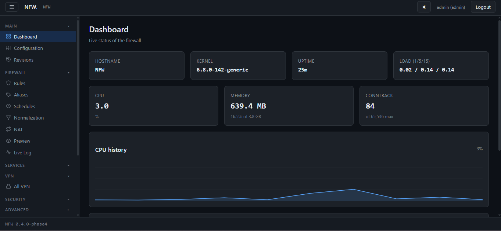
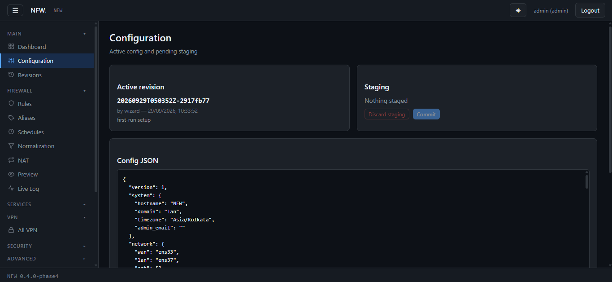
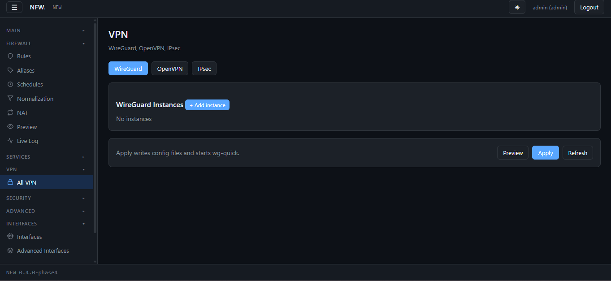
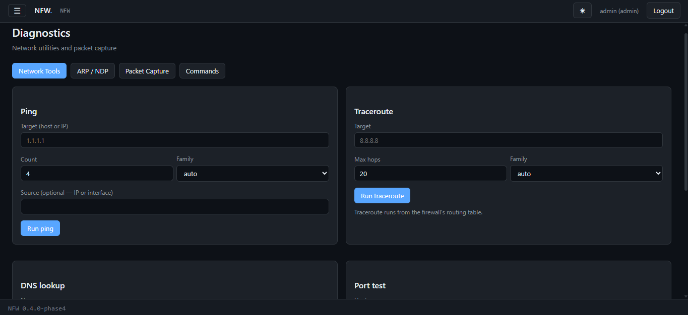
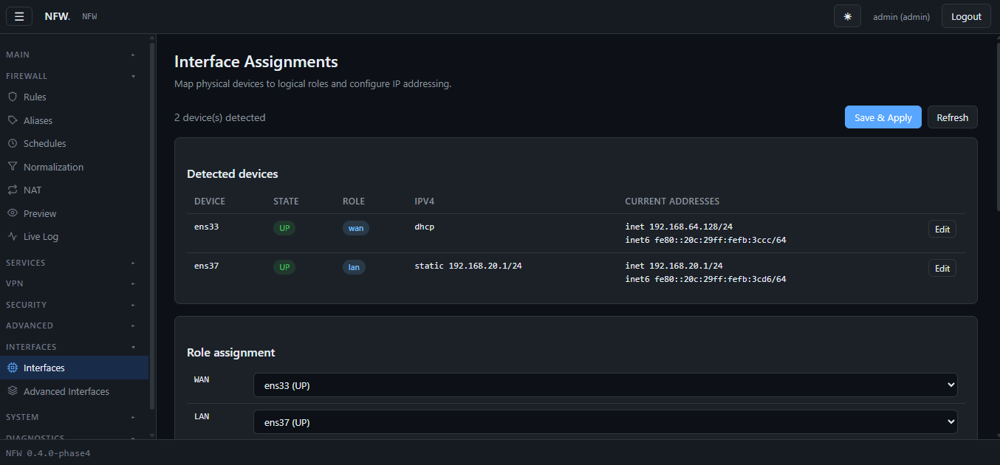

<div align="center">

# NFW — Nexus Firewall

**An OPNsense-style firewall for any Debian or Ubuntu server.**

nftables · FastAPI · systemd · captive portal · WireGuard · live logs · alerts · no proprietary bits

[](VERSION)
[](#license)
[](#requirements)
[](#roadmap)

[Features](#features) · [Install](#install) · [First run](#first-run) · [Upgrade](#upgrading) · [Architecture](#architecture) · [Roadmap](#roadmap)

</div>

---

## What is NFW?

NFW is a full-featured firewall operating system you install on top of Ubuntu
or Debian. It takes over a server and turns it into a router, NAT gateway,
VPN concentrator, IDS, captive portal, and DNS resolver with a modern web
interface.

It's aimed at the **homelab and small-business** crowd — anyone who wants
OPNsense-grade features without buying specific hardware, flashing a USB
image, or learning a proprietary console.

If you already run Ubuntu on a mini PC with two or more network cards, NFW
is a one-command install.

```bash
curl -fsSL https://raw.githubusercontent.com/Moonmaker5420/NFW/main/install.sh | sudo bash
```

---

## Screenshots



<table>
  <tr>
    <td width="50%">
      
      <br><sub><b>Configuration</b> — stage, commit, browse revisions, rollback</sub>
    </td>
    <td width="50%">
      
      <br><sub><b>VPN</b> — WireGuard, OpenVPN, IPsec with QR-based peer export</sub>
    </td>
  </tr>
  <tr>
    <td width="50%">
      
      <br><sub><b>Diagnostics</b> — ping, traceroute, DNS, packet capture</sub>
    </td>
    <td width="50%">
      
      <br><sub><b>Interfaces</b> — WAN/LAN/OPT role assignment</sub>
    </td>
  </tr>
</table>

---

## Features

### Firewall
- **nftables** ruleset with policy-drop defaults
- Stateful connection tracking, invalid-drop, SYN flood protection
- Rule-based scheduling, ICMP type filtering, DSCP, TCP flags
- **Aliases**: host, network, port, port-range, URL (fetched from HTTPS), GeoIP
- **NAT**: port-forward, 1:1, NPTv6, reflection, UPnP
- **Live preview** of the compiled ruleset before applying
- **Per-rule byte/packet counters** with a reset button and dead-rule detector
- **Live log viewer** — WebSocket-streamed, filterable, with pause/clear

### Networking
- Multi-NIC, WAN/LAN/OPT role assignment
- Multi-WAN gateways with failover groups
- Static routes, VLANs, bridges, bonds, GRE, VXLAN
- systemd-networkd backend — no custom network daemons

### VPN
- **WireGuard** — server + peer management, QR export
- **OpenVPN** — server + client, PKI integration
- **IPsec (strongSwan)** — IKEv1/IKEv2 via swanctl

### Services
- **DHCP** (ISC currently, Kea migration planned)
- **DNS** — Unbound recursive resolver with DoT forwarders
- **NTP** — chrony
- **FreeRADIUS** — PEAP-MSCHAPv2 + EAP-TTLS/PAP, LDAP backend
- **HAProxy** — reverse proxy frontend
- **Squid** — forward proxy / URL filtering
- **SNMP**, **DDNS**, **Wake-on-LAN**

### Captive Portal
- **Custom FastAPI portal** — no third-party daemon
- Voucher codes, MAC and hostname bypass, welcome-back grace
- Per-session bandwidth shaping via HTB (13-bucket ladder, 256 kbps → 1 Gbps)
- Custom portal templates (plain HTML with `{{var}}` substitution)
- **RFC 8910** (DHCP option 114) + **RFC 8908** (Captive Portal API)
- Windows / macOS / Android / Linux / Firefox / GNOME CPD detection
- Live session viewer with byte counts, live rates, and kick controls

### Security
- **Suricata** IDS/IPS integration
- **ACME** certificate management (Let's Encrypt, ZeroSSL, custom)
- **Internal CA** with certificate issuance, revocation, CRL
- **Local / LDAP / RADIUS / OAuth** authentication backends
- Role-based ACLs (readonly / operator / admin)
- 2FA (TOTP) with recovery codes

### Alerts & Notifications
- **SMTP delivery** with STARTTLS or implicit SSL
- Events: failed logins, firewall apply failures, expiring certificates
- Per-event thresholds and time windows
- SQLite-backed history — every send recorded (sent / failed / throttled)
- Throttling prevents alert storms — N events in M minutes → 1 alert
- "Send test email" button in the GUI

### Users & Access
- Full GUI user management — add, edit, change role, disable, delete
- Self-service password change
- Admin password reset for any user
- 2FA setup flow with QR / otpauth URI + recovery codes
- Role hierarchy: readonly < operator < admin
- ACL rules for fine-grained permission tweaks

### Web GUI
- Modern dark theme, responsive layout
- Collapsible sidebar with per-item icons, persisted state
- Live RRD graphs (system, memory, disk, per-interface)
- WebSocket notifications for long-running operations
- **First-run setup wizard** — no console required after install
- **System power** — reboot / power off with recovery poll

### Console
- `nfw-console-menu` on tty1 — assign interfaces, restart services, drop to shell
- Serial console auto-login for headless recovery

### Operations
- **`nfw-upgrade`** — one-command upgrade with automatic backup and rollback
- Config revisions with rollback to any prior state
- Full config export / import
- Boot-time permission enforcement (`nfw-fix-nfw-perms`, `nfw-fix-ca-perms`)
- Package-free: everything installs to `/opt/nfw`, no apt conflicts

---

## Requirements

| Item | Minimum |
|---|---|
| OS | Ubuntu 24.04 LTS or Debian 12 (Bookworm) |
| Architecture | x86_64, aarch64, armv7 |
| RAM | 1 GB |
| Disk | 4 GB free in `/opt` and `/var` |
| NICs | **2 minimum** (1 WAN, 1 LAN) — single-NIC mode not supported for routing |
| Init | systemd |

Tested on: Ubuntu 24.04 LTS, VMware Workstation, QEMU/KVM, Intel N100 mini PC.

**Not supported:** Alpine, RHEL, Arch, or any non-systemd distro. NFW takes
over the machine — do not install on a box running other critical services.

---

## Install

### One-liner (recommended)

```bash
curl -fsSL https://raw.githubusercontent.com/Moonmaker5420/NFW/main/install.sh | sudo bash
```

The installer is interactive. It will ask you to pick:

1. **WAN interface** — the NIC connected to your modem / upstream router
2. **LAN interface** — the NIC your internal network is on
3. **LAN IP** — default `192.168.10.1/24`
4. **Hostname** — default `nfw`
5. **Admin password** — a random one is generated and shown

Sensible defaults are pre-filled based on detected interfaces. Press **Enter**
through everything if you're not sure.

### From a local tree (development)

```bash
git clone https://github.com/Moonmaker5420/NFW.git
cd NFW
sudo NFW_SOURCE="$PWD" bash install.sh
```

### Non-interactive (automation)

```bash
sudo NFW_WAN_IFACE=ens33 \
     NFW_LAN_IFACE=ens37 \
     NFW_LAN_IP=192.168.10.1/24 \
     NFW_HOSTNAME=nfw \
     NFW_ADMIN_PW=changeme \
     NFW_NONINTERACTIVE=1 \
     bash install.sh
```

### What the installer does

1. Installs system dependencies (`nftables`, `openssl`, `chrony`, `rrdtool`, ...)
2. Copies NFW source to `/opt/nfw`
3. Creates the `nfw` system user/group
4. Builds a Python venv from bundled wheels (offline)
5. Generates a self-signed TLS cert
6. Writes initial config from your prompts
7. Creates the `admin` user
8. Enables + starts `nfw-configd`, `nfw-api`, `nfw-portal`
9. Applies the firewall ruleset

**Total time: ~90 seconds.**

---

## First run

After install, open the printed URL in a browser:

```
https://192.168.10.1:8443
```

Your browser will warn about the self-signed certificate — this is expected.
Accept and continue.

Log in with `admin` and the password from the install summary. You'll land
in the **setup wizard** — a 3-step flow that asks for:

1. Hostname and timezone
2. A new admin password
3. Confirmation

After completing the wizard, you're on the dashboard. Everything else is
configurable from the GUI.

### If you can't reach the GUI

**A. You're accessing from the WAN side (e.g. a cloud VM).**
By design, the GUI is only reachable on the LAN interface. Bring up a LAN
interface and use its IP.

**B. The LAN interface has no carrier.**
If the cable isn't plugged in, networkd won't bring the interface up.
Plug in a cable or set a static IP on your test machine.

**C. You need to reconfigure interfaces.**
Log in on the **console** (tty1 or serial) and use `nfw-console-menu` to
reassign interfaces, or drop to a shell and edit
`/var/lib/nfw/config/active.json`, then run `systemctl restart nfw-configd`.

---

## Using the GUI

| Section | What's there |
|---|---|
| **Dashboard** | Live system stats, CPU/memory/disk, load average |
| **Configuration** | Active config, staging, commit/rollback |
| **Firewall** | Rules, aliases, schedules, NAT, normalization, preview, **live log** |
| **Services** | DHCP, DNS, NTP, RADIUS, Captive Portal |
| **VPN** | WireGuard, OpenVPN, IPsec |
| **Security** | Suricata IDS, traffic shaping |
| **Advanced** | ACME, HAProxy, backup, DDNS/WoL/SNMP |
| **System** | Gateways, interfaces, routes, users, CA, auth, logs, alerts, power |
| **Diagnostics** | Ping, traceroute, DNS, pcap, arbitrary commands |
| **Reporting** | RRD graphs, top talkers, netflow |

The sidebar is collapsible. Categories remember their state in `localStorage`.

### Firewall → Live Log

Real-time stream of packets hitting the ruleset. Every policy drop is logged;
user rules with `Log` enabled also appear. Columns: Time, Action, Chain,
Source, Dest, Proto, Iface. Filters: Action, Chain, free-text search.
Pause/clear controls. Backed by a 5000-entry server-side ring buffer.

### Firewall → Rules → Counters

Every user rule shows live **Packets** and **Bytes**. Rules with zero traffic
are dimmed — a quick way to spot dead rules. Per-row reset button, plus
"Reset counters" for all rules. Auto-refresh every 5s while the page is open.

### System → Alerts

Configure SMTP and enable per-event notifications. Events available:

| Event | Default threshold |
|---|---|
| Failed logins | 5 per 15 minutes |
| Firewall apply failures | Immediate |
| Certificates expiring | 14 days before expiry |

Every alert is recorded in a history table with status and any SMTP error.
"Send test email" verifies the SMTP path.

### System → Power

Reboot or power off. Schedules the action 5 seconds out, shows a full-screen
overlay with a spinner, then polls `/api/health` until the firewall is back
and redirects to the login page. Cancel is possible during the 5-second delay.

---

## Upgrading

NFW has a built-in upgrade system with automatic backup and rollback.

### One-liner

```bash
sudo nfw-upgrade
```

This fetches the latest installer from GitHub, runs it in upgrade mode, and:

- Backs up config + code to `/opt/nfw/.backups/<timestamp>/`
- Stops services
- Replaces code
- Runs schema migrations (if any)
- Rebuilds the venv
- Restarts services
- Verifies health
- **Rolls back automatically** if the health check fails

### Manual

```bash
curl -fsSL https://raw.githubusercontent.com/Moonmaker5420/NFW/main/install.sh \
    | sudo bash -s -- --upgrade
```

### Dry-run

```bash
sudo nfw-upgrade --dry-run
```

### Force reinstall (same version)

```bash
sudo NFW_FORCE=1 bash install.sh
```

### What survives an upgrade

| Preserved | Replaced |
|---|---|
| `/var/lib/nfw/config/` | `/opt/nfw/core/` |
| `/etc/nfw/users.json` | `/opt/nfw/modules/` |
| `/etc/nfw/secret.key` | `/opt/nfw/web/` |
| `/var/lib/nfw/ca/` | `/opt/nfw/wheels/` |
| `/var/lib/nfw/captiveportal/` | `/opt/nfw/systemd/` |
| `/var/lib/nfw/aliases/` | `/opt/nfw/helpers/` |
| `/var/lib/nfw/alerts.db` | `/opt/nfw/venv/` (rebuilt) |

### Rolling back manually

```bash
sudo systemctl stop nfw-api nfw-portal nfw-configd
ls /opt/nfw/.backups/
# Restore a specific backup:
sudo cp -a /opt/nfw/.backups/<timestamp>/code/* /opt/nfw/
sudo cp -a /opt/nfw/.backups/<timestamp>/state/* /
sudo systemctl start nfw-configd nfw-api nfw-portal
```

---

## Uninstalling

```bash
sudo systemctl stop nfw-configd nfw-api nfw-portal
sudo systemctl disable nfw-configd nfw-api nfw-portal nfw-fix-nfw-perms nfw-fix-ca-perms
sudo systemctl disable --now 'nfw-*.timer'
sudo rm -rf /opt/nfw /var/lib/nfw /etc/nfw /var/log/nfw
sudo rm -f /usr/local/sbin/nfw-*
sudo rm -f /etc/systemd/system/nfw-*.service /etc/systemd/system/nfw-*.timer
sudo rm -rf /etc/systemd/system/nfw-api.service.d
sudo systemctl daemon-reload
sudo userdel nfw; sudo groupdel nfw
```

---

## Architecture

```
┌────────────────────────────────────────────────────────┐
│  Browser                                               │
└──────────┬─────────────────────────────────────────────┘
           │ HTTPS :8443
┌──────────▼─────────────────────────────────────────────┐
│  nfw-api.service    (uvicorn as www-data:nfw)          │
│  ─ FastAPI app, Jinja2 templates, static assets        │
│  ─ TLS via systemd LoadCredential (root-only key)      │
│  ─ SupplementaryGroups=systemd-journal (live log)      │
│  ─ Live log reader + WebSocket streaming               │
│  ─ In-memory session store (sessions survive           │
│    page navigation but not API restarts)               │
└──────────┬─────────────────────────────────────────────┘
           │ Unix socket /run/nfw/configd.sock
┌──────────▼─────────────────────────────────────────────┐
│  nfw-configd.service    (Python 3.12, root, sandboxed) │
│  ─ Privileged action registry                          │
│  ─ Writes nft, networkd, dhcpd, freeradius, ...        │
│  ─ SO_PEERCRED authorization                           │
│  ─ Alerts dispatcher (SQLite + SMTP)                   │
│  ─ Power actions via systemd-run                       │
└────────────────────────────────────────────────────────┘

┌────────────────────────────────────────────────────────┐
│  nfw-portal.service    (uvicorn as www-data:nfw)       │
│  ─ Captive portal login page, vouchers, templates      │
│  ─ CPD handlers (Apple/Android/Windows/Firefox/GNOME)  │
└────────────────────────────────────────────────────────┘
```

**Why a separate privileged daemon?** The API runs as an unprivileged user
with a sandboxed systemd unit (`ProtectSystem=full`, `NoNewPrivileges`,
etc.). Anything that requires root — writing `/etc/nftables.conf`, restarting
services, manipulating firewall sets — is dispatched to `nfw-configd` over
a Unix socket. The daemon validates the action against a whitelist and
checks the peer's credentials.

**Config store** is revision-based. Every change creates a new
`revisions/<timestamp>-<hash>.json` and updates `active.json`. Rollback is
a pointer swap.

**State layout** (`/var/lib/nfw`):

```
/var/lib/nfw/
├── config/
│   ├── active.json             {"revision": ..., "ts": ...}
│   ├── revisions/<rev>.json    full config
│   ├── staging.json            pending changes
│   ├── setup_pending           first-run wizard marker
│   └── initialized             firstboot marker
├── ca/                         internal CA + bootstrap TLS
├── captiveportal/              sessions.db, templates, bypass caches
├── aliases/                    URL / GeoIP cache
├── rrd/                        RRD metric files
├── shaper/                     tc filter state
├── alerts.db                   alert event + send history
└── backups/                    config-store rolling backups
```

---

## Configuration

NFW's config is a single JSON document. Keys are stable and versioned.
Example:

```json
{
  "system":  { "hostname": "nfw", "timezone": "UTC" },
  "network": {
    "wan": "enp1s0",
    "lan": "enp2s0",
    "interfaces": {
      "enp2s0": { "ipv4": { "mode": "static",
                            "address": "192.168.10.1",
                            "prefixlen": 24 } }
    }
  },
  "firewall": { "rules": [], "aliases": [] },
  "services": {
    "captiveportal_config": { "enabled": false },
    "notifications": {
      "enabled": true,
      "smtp": { "host": "smtp.example.com", "port": 587,
                "to_addrs": ["admin@example.com"] },
      "events": {
        "login_failed":          { "enabled": true, "threshold": 5, "window_minutes": 15 },
        "firewall_apply_failed": { "enabled": true },
        "cert_expiring":         { "enabled": true, "days_before": 14 }
      }
    }
  },
  "auth":     { "providers": [{ "type": "local", "enabled": true }] }
}
```

### Editing config

- **Prefer the GUI.** It validates before writing.
- **CLI**: edit `/var/lib/nfw/config/active.json` and run
  `systemctl restart nfw-configd`.
- **Never** edit `/etc/nftables.conf` by hand — it's generated.

---

## CLI reference

| Command | What it does |
|---|---|
| `install.sh` | Install or upgrade NFW |
| `install.sh --upgrade` | Force upgrade mode |
| `install.sh --dry-run` | Show what would happen, do nothing |
| `install.sh --force` | Reinstall even if versions match |
| `nfw-upgrade` | Fetch latest installer and upgrade |
| `nfw-console-menu` | Interactive console menu (tty1) |

Systemd units:

| Unit | Role |
|---|---|
| `nfw-configd.service` | Privileged action dispatcher |
| `nfw-api.service` | HTTPS API + GUI |
| `nfw-portal.service` | Captive portal |
| `nfw-firstboot.service` | First-boot bootstrap (image installs) |
| `nfw-console.service` | Console menu on tty1 |
| `nfw-fix-nfw-perms.service` | `/var/lib/nfw` permission enforcement |
| `nfw-fix-ca-perms.service` | CA material enforcement |
| `nfw-*.timer` | Scheduled tasks |

---

## Development

### Local dev loop

The fastest way to iterate: install once, then push changes and restart
services. ~15 seconds per cycle.

```bash
# Edit code in /opt/nfw
sudo systemctl restart nfw-api nfw-configd
# Reload browser
```

### Testing

Post-install smoke test — 42 checks covering services, API endpoints,
kernel state, and captive portal:

```bash
sudo bash tests/verify-install.sh
```

Dry-run the installer:

```bash
sudo bash install.sh --dry-run
```

### Migrations

Schema changes to the config format go in `migrations/<from>_to_<to>.sh`.
The runner (`migrations/run.sh`) executes them automatically during upgrade.
See `migrations/README.md`.

### Reporting bugs

Include:

- Output of `sudo bash tests/verify-install.sh`
- Output of `systemctl --failed --no-pager`
- The install log: `/var/log/nfw-install.log`
- `journalctl -u nfw-api -n 100`

---

## Security model

NFW treats the firewall as a security boundary, and treats itself the same way.

- **API runs unprivileged** as `www-data:nfw` in a sandboxed systemd unit
- **Privileged operations** go through `nfw-configd`, which runs as root but
  dispatches only whitelisted actions and checks `SO_PEERCRED`
- **TLS keys** are `root:root 0400`; the API reads them via systemd's
  `LoadCredential=` (copies into a tmpfs owned by the service user)
- **CA material** is never group-readable. Per-file perms are enforced at
  every boot by `nfw-fix-ca-perms.service`
- **`/var/lib/nfw` tree** is `root:nfw 0750`, enforced at every boot by
  `nfw-fix-nfw-perms.service`
- **Power actions** are named `power.*` (not `system.*`) so the API can call
  them. Access is gated by `require_acl("admin")` at the API layer.
- **The GUI is LAN-only** by design. Do not expose port 8443 to the internet.
  Use a VPN to reach it remotely.

### Reporting security issues

**Do not open a public issue.** Email the maintainer directly (address in
`git log`). We aim to acknowledge within 72 hours.

---

## Troubleshooting

### "ERR_CONNECTION_TIMED_OUT" when opening the GUI

You're on the WAN side. By design the GUI is only on the LAN.
**Fix:** bring up a LAN interface, use its IP. Or SSH to the box and
`curl -k https://127.0.0.1:8443/api/health` to confirm the API is running.

### "Invalid username or password" but the password is right

Two known causes:

- `/etc/nfw/users.json` has wrong permissions. Fix:
  `sudo chown root:nfw /etc/nfw/users.json && sudo chmod 0640 /etc/nfw/users.json && sudo systemctl restart nfw-api`
- bcrypt hash key mismatch. Check `grep '"hash"' /etc/nfw/users.json`. The
  key must be `"hash"`, not `"password_hash"`.

### Wizard reappears after setup

Check permissions on the config directory. The API user must be able to
traverse it:

```bash
sudo chown root:nfw /var/lib/nfw/config
sudo chmod 0750 /var/lib/nfw/config
sudo systemctl restart nfw-fix-nfw-perms.service
```

### Alerts not sending

Test the SMTP path directly:

```bash
# In the GUI: System → Alerts → Send test email
# Or CLI:
python3 -c "
import socket, json
s = socket.socket(socket.AF_UNIX, socket.SOCK_STREAM)
s.settimeout(30)
s.connect('/run/nfw/configd.sock')
s.sendall((json.dumps({'action':'alerts.test','data':{}})+'\n').encode())
buf=b''
while not buf.endswith(b'\n'):
    c=s.recv(4096); buf+=c
print(json.loads(buf))
"
```

Check the error message in the response, and review recent alerts at
`System → Alerts → Recent alerts`. Common issues: wrong port for
STARTTLS (587) vs implicit SSL (465), or an SMTP provider blocking the
"from" address.

### Captive portal popup not showing

The client OS probes a known URL (e.g. `captive.apple.com`) and expects the
"you're online" response. NFW returns a `302` to the portal login page for
unauthenticated clients. If the popup isn't firing:

1. Confirm the redirect: `curl -v http://captive.apple.com/hotspot-detect.html` from the client
2. Verify no CPD hostnames are in the walled garden
3. Wait — some OSes only probe on network changes

### Live log shows only drops

Drops are always logged. Accepts/rejects appear only for user rules with
`Log` enabled. Toggle `Log` on a rule in `Firewall → Rules` to see its
traffic.

### "Setup pending" error after upgrade

The wizard marker should not survive an upgrade. If it does:

```bash
sudo rm /var/lib/nfw/config/setup_pending
sudo systemctl restart nfw-api
```

### WebSocket reconnect storm in the log

`journalctl -u nfw-api | grep 'WebSocket.*403'` shows a browser retrying
a stale session every few seconds. Log out and log back in — this is a
known symptom of the in-memory session store losing state on API restart.

---

## Roadmap

**v0.1.x — current**
- ✅ Firewall rules, NAT, aliases, per-rule counters
- ✅ Multi-WAN gateways
- ✅ Captive portal (vouchers, bypass, shaping, RFC 8910/8908)
- ✅ FreeRADIUS
- ✅ Suricata IDS
- ✅ WireGuard / OpenVPN / IPsec
- ✅ First-run wizard
- ✅ Upgrade system with rollback
- ✅ Live log viewer (WebSocket)
- ✅ SMTP alerts
- ✅ Users GUI management
- ✅ System power page

**v0.2.x — next**
- [ ] Persistent session store (currently in-memory; users log out on API restart)
- [ ] DHCP Kea v4/v6 (replace EOL ISC dhcpd)
- [ ] Dashboard widget framework
- [ ] Setup-mode WAN GUI access (bootstrap wizard from any interface)
- [ ] DNS blocklists (Pi-hole parity)
- [ ] Cert-expiring alert hook wired into CA autorenew
- [ ] WebSocket client: stop retrying on 4401 close

**v0.3.x — planned**
- [ ] High availability (CARP-equivalent + conntrackd)
- [ ] Dynamic routing (FRR — OSPF, BGP, RIP, BFD)
- [ ] IPv6 captive portal (dual-stack)
- [ ] Multi-zone captive portal (per-interface policies)
- [ ] Configuration backup to cloud (S3, WebDAV)
- [ ] Schedule / cron GUI

**Long-term**
- [ ] ISO installer (live-boot → install to disk)
- [ ] Signed image + `systemd-sysupdate` appliance SKU
- [ ] Plugin API for third-party integrations

Feature requests welcome — open an issue.

---

## FAQ

**Q: Why not just use OPNsense?**
A: OPNsense is excellent. NFW exists for people who already run Ubuntu or
Debian and don't want to reinstall their OS to get a firewall. Also for
anyone who wants to hack on the source without learning FreeBSD.

**Q: Can I install NFW alongside other services?**
A: It's not designed for that. NFW takes over the machine's networking —
iptables/nftables rules, systemd-networkd config, DHCP, DNS ports. Running
it next to, say, a Pi-hole install will cause conflicts.

**Q: Does NFW support IPv6?**
A: Partially. Firewall and interfaces are dual-stack. The captive portal is
IPv4-only as of 0.1.x — IPv6 support is on the roadmap.

**Q: How do I upgrade from a really old version?**
A: One version at a time. The upgrade system handles adjacent versions and
runs migrations in order. Chain multiple `nfw-upgrade` runs if needed.

**Q: Where do I report bugs?**
A: [GitHub Issues](https://github.com/Moonmaker5420/NFW/issues). Include
the output of `tests/verify-install.sh` and the install log.

**Q: Is NFW production-ready?**
A: For homelabs and small offices, yes. For high-value infrastructure,
wait for the 1.0 tag — the firewall ruleset and upgrade path are stable
but not externally audited.

---

## Credits

Built by [@Moonmaker5420](https://github.com/Moonmaker5420) and contributors.

Design inspired by [OPNsense](https://opnsense.org/) and [pfSense](https://www.pfsense.org/).
Installer UX inspired by [Pi-hole](https://pi-hole.net/).

Uses, with thanks:
[FastAPI](https://fastapi.tiangolo.com/) · [uvicorn](https://www.uvicorn.org/) ·
[nftables](https://netfilter.org/projects/nftables/) · [systemd](https://systemd.io/) ·
[Unbound](https://nlnetlabs.nl/projects/unbound/about/) ·
[chrony](https://chrony.tuxfamily.org/) ·
[FreeRADIUS](https://freeradius.org/) ·
[Suricata](https://suricata.io/) ·
[WireGuard](https://www.wireguard.com/)

---

## License

TBD — a permissive license (MIT or Apache-2.0) is planned before the first
public release. Until then, the code is shared for evaluation only.

---

<div align="center">

**Found this useful?** ⭐ the repo.

**Want to contribute?** Read the [roadmap](#roadmap) and open an issue.

</div>
